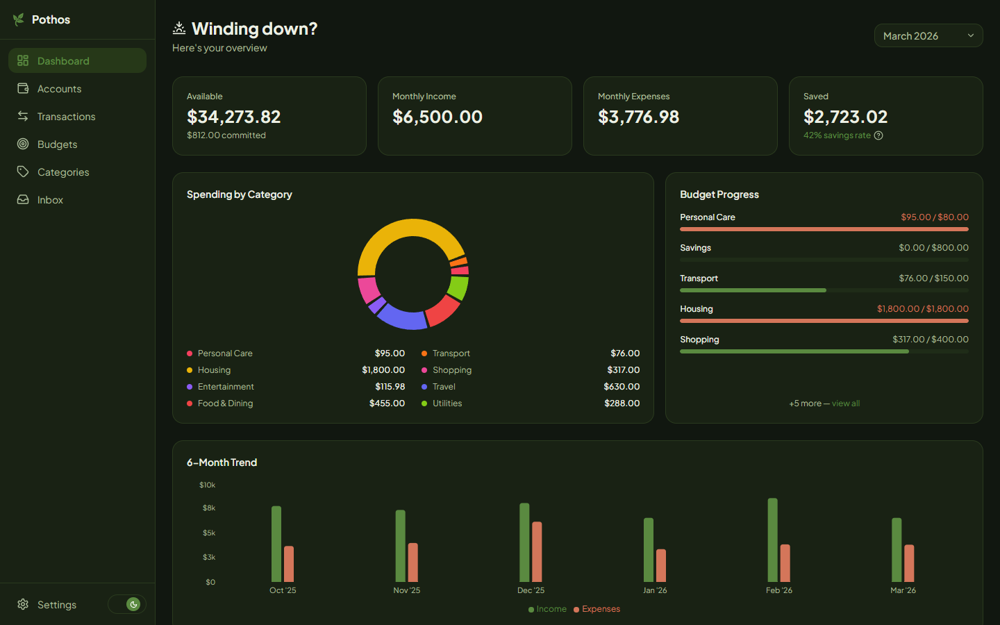

# Pothos

A self-hostable, open-source budget and expense tracking app.



**Live demo:** [pothos.bryanronad.com](https://pothos.bryanronad.com)

---

## Features

- Manual transaction entry with decimal precision
- Multiple accounts with balance tracking and transfer support
- Monthly budgets per category with spent/remaining tracking
- Dashboard with spending overview, category breakdown, and trends
- IMAP email ingestion with LLM parsing (bring your own API key)
- MCP server for agent-based access via Claude Code/Desktop, Codex, Cursor, and more

## Stack

| Layer    | Tech                                   |
| -------- | -------------------------------------- |
| Backend  | Fastify, TypeScript, SQLite (Drizzle)  |
| Frontend | Next.js, Tailwind CSS, shadcn/ui       |
| Auth     | Email + password, server-side sessions |
| Worker   | Node.js cron, IMAP poller, LLM adapter |
| MCP      | `@modelcontextprotocol/sdk`, stdio     |

---

## Getting Started

### Local Development

1. Copy the environment file and fill in the required values:

```bash
cp backend/.env.example backend/.env
```

2. Install dependencies and set up the database:

```bash
cd backend && npm install && npm run db:migrate && npm run db:seed
cd ../frontend && npm install
```

3. Start the dev servers (each in a separate terminal):

```bash
cd backend && npm run dev
cd frontend && npm run dev
```

To run the email polling worker:

```bash
cd backend && npm run dev:worker
```

### Self-Hosting

Requires a Linux VPS with Docker, Docker Compose, and ports 80 and 443 open.

```bash
git clone https://github.com/pothos-wealth/pothos.git
cd pothos && chmod +x scripts/setup.sh && ./scripts/setup.sh
```

The setup script prompts for your domain, generates secrets, provisions a Let's Encrypt SSL certificate, and starts all services.

For subsequent deploys:

```bash
./scripts/deploy.sh
```

See [DEPLOYMENT.md](DEPLOYMENT.md) for the full setup guide.

---

## MCP Server

The Pothos MCP server runs on your local machine and connects to your hosted Pothos instance. It exposes your finances as tools to any MCP-compatible AI agent (Claude Desktop, Claude Code, Cursor, Cline, and more). No inbound connections required.

See [mcp/README.md](mcp/README.md) for setup instructions and available tools.

---

## License

[AGPL v3](LICENSE) - modified versions that are run as a network service must also be open-sourced.
